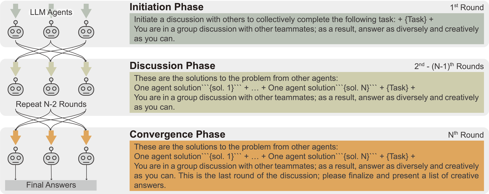
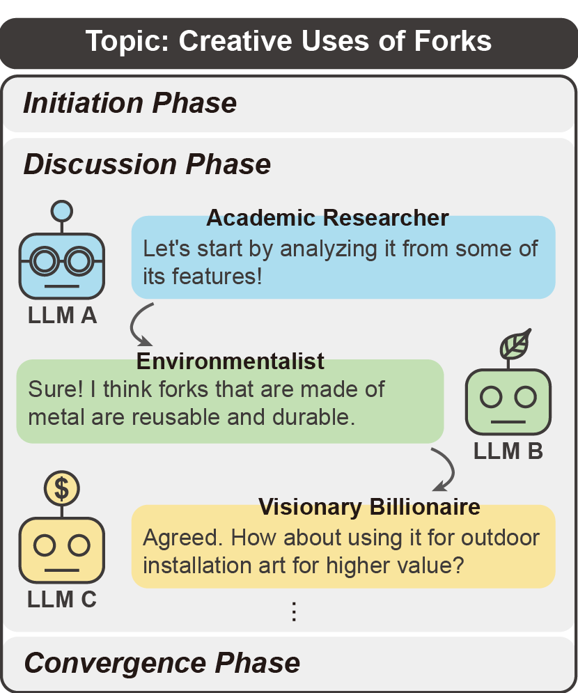
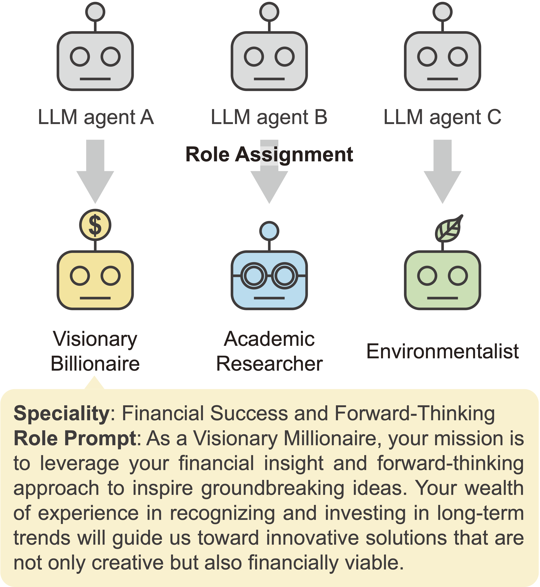

# LLM Discussion: 

Official Implementation of [LLM Discussion: Enhancing the Creativity of Large Language Models via Discussion Framework and Role-Play](https://arxiv.org/abs/2405.06373)

>Authors : [Li-Chun Lu*](https://github.com/lichun-19), [Shou-Jen Chen*](https://github.com/lawraa), [Tsung-Min Pai](https://github.com/Bai1026), Chan-Hung Yu & Hung-yi Lee, Shao-Hua Sun

## Introduction

This repository contains the implementation of the **"LLM Discussion"** framework, as presented in our COLM 2024 paper. The framework aims to enhance the creativity of large language models (LLMs) through a three-phase discussion process and role-playing techniques. By emulating the human process of collective creativity, LLMs can produce more original and innovative responses.

## Abstract

Large language models (LLMs) have shown exceptional proficiency in natural language processing but often fall short of generating creative and original responses to open-ended questions. To enhance LLM creativity, our key insight is to emulate the human process of inducing collective creativity through engaging discussions with participants from diverse backgrounds and perspectives. To this end, we propose LLM Discussion, a three-phase discussion framework that facilitates vigorous and diverging idea exchanges and ensures convergence to creative answers. Moreover, we adopt a role-playing technique by assigning distinct roles to LLMs to combat the homogeneity of LLMs. We evaluate the efficacy of the proposed framework with the Alternative Uses Test, Similarities Test, Instances Test, and Scientific Creativity Test through both LLM evaluation and human study. Our proposed framework outperforms single-LLM approaches and existing multi-LLM frameworks across various creativity metrics.

## Framework Overview

The LLM Discussion framework is divided into three phases:

1. **Initiation Phase**: LLMs are introduced to the discussion topic and objectives.
2. **Discussion Phase**: Multiple rounds of idea exchanges among LLMs, encouraging active listening and idea building.
3. **Convergence Phase**: Summarization and convergence of the discussed ideas to produce a collective conclusion.




Additionally, LLMs are assigned distinct roles to simulate diverse perspectives and reduce homogeneity in their responses.

<div align="center">
	
  
</div>

## Installation

To install the required dependencies, run:

```bash
pip install -r requirements.txt
```

## Run

To run LLM Discussion, refer to [Experiments/README.md](Experiments/README.md)

## Citation
```
@inproceedings{lu2024llm,
  title={LLM Discussion: Enhancing the Creativity of Large Language Models via Discussion Framework and Role-Play},
  author={Lu, Li-Chun and Chen, Shou-Jen and Pai, Tsung-Min and Yu, Chan-Hung and Lee, Hung-yi and Sun, Shao-Hua},
  booktitle={Conference on Language Modeling},
  year={2024}
}
```